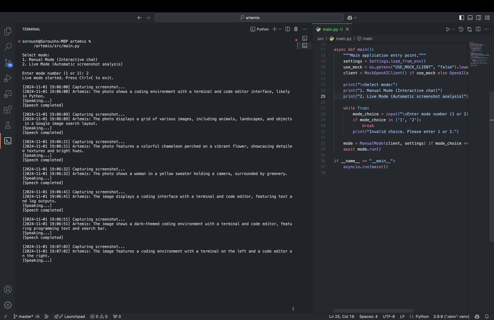

# Eyra

[](LICENSE)
[]()
[]()

**Personal on-device agent for the terminal.**

Eyra listens, thinks, and acts. It takes voice or typed input, routes to the right model, and calls tools when needed. Everything runs on your machine by default. No telemetry, no polling. Works with any OpenAI-compatible provider, local or remote.

<p align="center"></p>

---

## Quick Start

Requires an AI provider with an OpenAI-compatible API. Defaults to [Ollama](https://ollama.com) at `localhost:11434`. Point `API_BASE_URL` in `.env` at any other provider.

```bash
git clone https://github.com/gabrimatic/eyra.git
cd eyra
chmod +x setup.sh && ./setup.sh
```

Setup creates `.env`, installs dependencies, and verifies your backend and models. Then run:

```bash
uv run python src/main.py
```

Eyra runs preflight checks, then enters a live session:

```
Eyra

  Voice: on    Backend: ready

  Type anything or speak. /help for commands.
```

From this point, Eyra is listening. Type or speak at any time.

---

## What It Does

- Launches directly into a live, always-on agent session
- Accepts typed or spoken input without leaving the session
- Routes requests to the appropriate model (complexity routing available as an experimental option)
- Uses tools (screenshot, time, weather, clipboard, system info, web browsing, filesystem) on demand via function calling
- Speaks responses via local-whisper when available
- Works with any OpenAI-compatible provider (Ollama, LM Studio, vLLM, OpenRouter, etc.)
- All image data stays in memory, no disk I/O

---

## How It Works

Eyra runs as one live session with concurrent subsystems:

- **Voice** is powered by [Local Whisper](https://github.com/gabrimatic/local-whisper), which handles both directions: input (ASR via Qwen3-ASR) and output (TTS via Kokoro). Eyra records from the microphone via sounddevice and classifies each 32ms frame with Silero VAD. When the speaker pauses, audio is transcribed through Local Whisper. Speak naturally; Eyra interrupts its own speech to hear you. Toggle with `/voice on|off`.
- **Typed input** is always available inline. Both input channels feed the same conversation.
- **Complexity routing** (experimental, off by default) scores requests deterministically and dispatches to Simple, Moderate, or Complex tier. When disabled, all requests use a single configurable model.
- **Tool use** gives the model access to screenshot, time, weather, clipboard, and system info. Tools are defined as OpenAI function-calling schemas and executed locally. When complexity routing is enabled, Simple/Moderate tiers get lightweight tools and Complex gets all tools including screenshot.

### Preflight

On startup, Eyra validates:

- Backend reachability (tries `/v1/models`, falls back to Ollama `/api/tags`)
- Every configured model exists (auto-pulls via Ollama if needed)
- [Local Whisper](https://github.com/gabrimatic/local-whisper) for voice input and speech output (`brew tap gabrimatic/local-whisper && brew install local-whisper`)
- Screen capture (macOS built-in)

The session does not start until the backend and models are confirmed ready.

---

## Commands

| Command | What it does |
|---------|-------------|
| `/voice on\|off` | Toggle voice input and speech output |
| `/mute` | Mute speech output only |
| `/unmute` | Unmute speech |
| `/goal <text>` | Set a conversational goal ("tell me when an error appears") |
| `/mode fast\|balanced\|best` | Set quality mode |
| `/status` | Show current runtime state |
| `/clear` | Reset conversation history |
| `/quit` | Exit |

Unknown commands are caught locally and never sent to the model.

---

## Quality Modes

Control the speed/quality trade-off with `/mode`:

| Mode | Behavior |
|------|----------|
| `fast` | Always use the smallest model |
| `balanced` | Let the router decide (default) |
| `best` | Always use the strongest model |

---

## Complexity Routing

Complexity routing is **experimental and off by default**. When disabled (`COMPLEXITY_ROUTING_ENABLED=false`), all requests use the single `MODEL` setting with all tools available.

When enabled (`COMPLEXITY_ROUTING_ENABLED=true`), every request in `balanced` mode is scored by `ComplexityScorer` before dispatch.

Scoring factors:

- Pattern matching for common prompt types
- Weighted signal scoring (reasoning cues, code/debug cues, domain terms)
- Prompt length and constraint analysis
- Follow-up context from recent messages

| Score | Model |
|-------|-------|
| Simple | `SIMPLE_MODEL` |
| Moderate | `MODERATE_MODEL` |
| Complex | `MODEL` |

All model names are set in `.env`. Any model supported by your provider works.

---

## Configuration

<details><summary><strong>.env reference</strong></summary>

```env
# Provider — any OpenAI-compatible endpoint
API_BASE_URL=http://localhost:11434/v1
API_KEY=ollama        # leave as-is for local; set your key for cloud providers

USE_MOCK_CLIENT=false

# Default model for all requests (used when complexity routing is off)
MODEL=qwen3.5:4b

# Tier models — only used when COMPLEXITY_ROUTING_ENABLED=true
SIMPLE_MODEL=qwen3.5:2b
MODERATE_MODEL=qwen3.5:4b

# Live runtime settings
AUTO_PULL_MODELS=true
LIVE_LISTENING_ENABLED=true
LIVE_SPEECH_ENABLED=true
SPEECH_COOLDOWN_MS=3000
VOICE_SILENCE_MS=1500          # silence after speech before processing (ms)
VOICE_VAD_THRESHOLD=0.6        # Silero VAD sensitivity (0.0-1.0, higher = stricter)

# Experimental: complexity-based routing. When disabled, all requests use MODEL.
COMPLEXITY_ROUTING_ENABLED=false

# Filesystem sandbox — comma-separated list of allowed root paths
FILESYSTEM_ALLOWED_PATHS=~,/tmp
FILESYSTEM_DEFAULT_PATH=~/Documents
```

`API_BASE_URL` accepts any OpenAI-compatible endpoint. Point it at Ollama (default), LM Studio, vLLM, OpenRouter, Groq, or OpenAI itself. `API_KEY` is ignored by local providers but required for cloud ones.

</details>

---

## Privacy

| Component | Where it runs |
|-----------|--------------|
| AI backend | `API_BASE_URL` (default: localhost:11434) |
| Silero VAD | Neural ONNX model, runs in-process, fully local |
| Voice recording | sounddevice (PortAudio), in-process, fully local |
| wh transcribe (local-whisper) | Subprocess, fully local |
| wh whisper (local-whisper) | Subprocess, fully local |
| Screenshots | In-memory only, never written to disk |

No telemetry. No analytics. By default everything runs on your machine. If you point `API_BASE_URL` at a remote provider, prompts and images will leave your machine to that provider.

---

## Architecture

```
eyra/
├── pyproject.toml
├── setup.sh
├── src/
│   ├── main.py                     # Entry point, preflight, live session launch
│   ├── runtime/
│   │   ├── live_session.py         # Unified orchestrator
│   │   ├── models.py              # Runtime state and event dataclasses
│   │   ├── preflight.py           # Backend, model, and capability validation
│   │   ├── startup.py             # First-run setup and .env management
│   │   ├── speech_controller.py   # TTS output and STT input coordination
│   │   ├── voice_input.py         # Silero VAD recording + local-whisper transcription
│   │   └── status_presenter.py    # User-facing status header and updates
│   ├── tools/
│   │   ├── base.py                # BaseTool abstract + ToolResult
│   │   ├── registry.py            # Tool registry and dispatch
│   │   ├── screenshot.py          # In-memory screenshot via mss
│   │   ├── time_tool.py           # Current time tool
│   │   ├── weather.py             # Weather info tool
│   │   ├── clipboard.py           # Clipboard reader tool
│   │   ├── system_info.py         # System info tool
│   │   ├── browser.py             # Web search, URL navigation, page interaction
│   │   └── filesystem.py          # Sandboxed file read/write/edit/list
│   ├── chat/
│   │   ├── capture.py             # In-memory screenshot capture
│   │   ├── complexity_scorer.py   # Deterministic prompt routing
│   │   ├── message_handler.py     # Model selection, response shaping, streaming
│   │   └── session_state.py       # Shared session types
│   ├── clients/
│   │   ├── base_client.py         # BaseAIClient abstract
│   │   └── ai_client.py           # OpenAI-compatible async client
│   └── utils/
│       ├── settings.py
│       ├── image_history.py
│       ├── sound_player.py
│       ├── theme.py
│       └── mock_client.py
```

---

## Troubleshooting

<details><summary><strong>AI backend not responding</strong></summary>

Check that your backend is running and reachable at the URL in `API_BASE_URL`. Eyra probes `/v1/models` on startup and reports the result.

For Ollama (default):

```bash
ollama list
curl http://localhost:11434/v1/models
```

If using a different provider, verify `API_BASE_URL` and `API_KEY` in `.env` are correct.

</details>

<details><summary><strong>Voice not working</strong></summary>

Voice requires [Local Whisper](https://github.com/gabrimatic/local-whisper), which powers both input (ASR) and output (TTS). Install it:

```bash
brew tap gabrimatic/local-whisper && brew install local-whisper
```

Eyra's preflight automatically detects the installation (even if `wh` is not on PATH) and starts the service if needed. If preflight reports it's installed but not running, start manually with `wh start`.

You can also toggle voice at runtime with `/voice on|off`.

</details>

---

## Development

```bash
git clone https://github.com/gabrimatic/eyra.git
cd eyra
./setup.sh
uv run pytest -q
USE_MOCK_CLIENT=true uv run python src/main.py
```

---

## Credits

[Ollama](https://ollama.com) · [local-whisper](https://github.com/gabrimatic/local-whisper) (STT + TTS via Kokoro) · [Silero VAD](https://github.com/snakers4/silero-vad) (voice activity detection) · [mss](https://github.com/BoboTiG/python-mss)

<details>
<summary><strong>Legal notices</strong></summary>

### Trademarks

"Ollama" is a trademark of its respective owner. All trademark names are used solely to describe compatibility with their respective technologies. This project is not affiliated with, endorsed by, or sponsored by any trademark holder.

### Third-Party Licenses

All dependencies use MIT, BSD, or Apache 2.0 licenses. See each package for details.

</details>

## License

MIT. See [LICENSE](LICENSE).

---

Created by [Soroush Yousefpour](https://gabrimatic.info)

[](https://www.buymeacoffee.com/gabrimatic)
